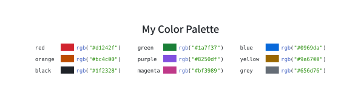

  <h1>🌌 Typst Universal</h1>
  

  
  
  

[Typst] is a modern typesetting system considered to be the successor to
LaTeX. The **enhanced** 💪 and more **user-friendly** 🤗 capability to hack is
one of the primary advantages of Typst over LaTeX. This repository provides a
comprehensive collection of useful utilities and [modules] to help you compose
documents 📄 in a decent and fancy style with ease.

  

**Caution:** Typst and this repository are still under active development,
it's not recommended to use in production.

<!-- Links -->
[Typst]: https://typst.app/
[modules]: modules/
